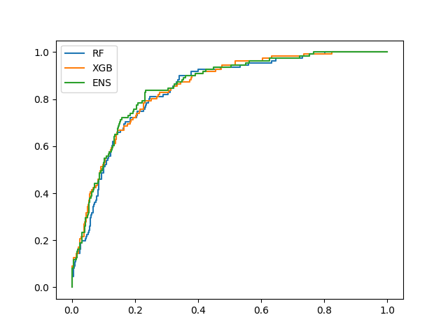
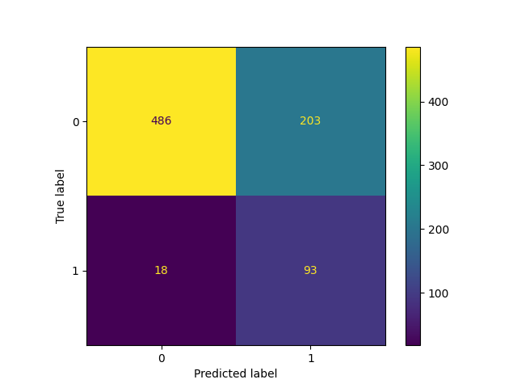
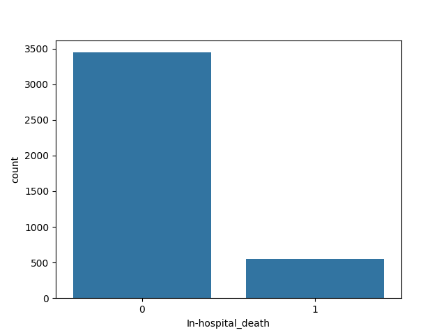
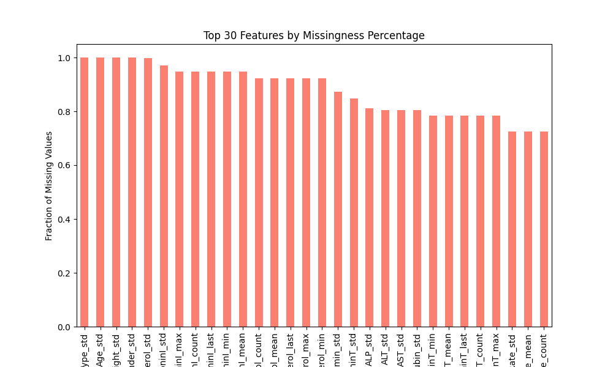
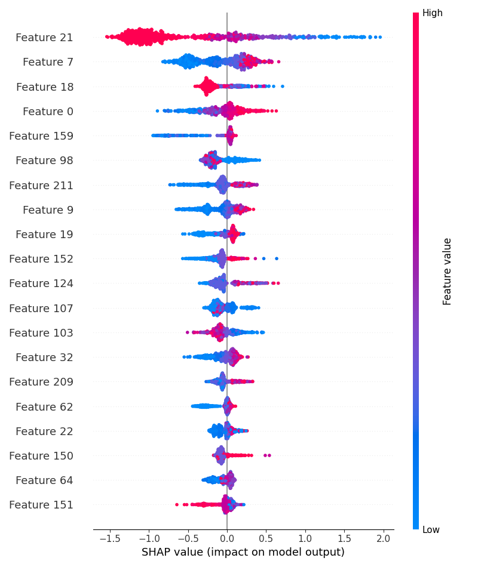

# ICU Mortality Prediction

Predicting **in-hospital mortality** of ICU patients from their first 48 hours of vital signs and lab results, using a Random Forest + XGBoost soft-voting ensemble with SHAP explanations.

> [!WARNING]
> This is an educational / research project. It is **not** a validated clinical tool. Do not use it for real patient care.

---

## Table of Contents

- [The Problem](#the-problem)
- [Key Features](#key-features)
- [Results](#results)
- [Project Structure](#project-structure)
- [Setup](#setup)
- [Usage](#usage)
- [Data](#data)
  - [Source](#source)
  - [What the dataset contains](#what-the-dataset-contains)
  - [Data produced by this project](#data-produced-by-this-project)
  - [Why each piece of data is used](#why-each-piece-of-data-is-used)
  - [Limitations](#limitations)
- [Privacy & What Is Not in This Repo](#privacy--what-is-not-in-this-repo)
- [Citation & License](#citation--license)

---

## The Problem

Intensive Care Units have limited beds, staff and attention. Spotting which patients are at the highest risk of dying **early** in their stay helps clinicians decide who to escalate, monitor more closely, or have goals-of-care conversations with.

Traditional severity scores (SAPS, SOFA, APACHE) are hand-built point systems. This project asks whether a machine-learning model trained on raw, irregularly sampled ICU measurements can flag high-risk patients, with a focus on **catching as many deaths as possible** (high recall), because missing a high-risk patient costs far more than a false alarm.

## Key Features

- **Turns irregular time series into a table.** Each patient's raw `(Time, Parameter, Value)` log becomes per-variable `mean`, `max`, `min`, `std`, `last` and `count` features (about 200 columns).
- **Missing-data handling.** `-1` placeholder values are removed, columns that are more than 70% missing are dropped, and the remaining gaps are filled with the median.
- **No data leakage.** The stratified 80/20 split happens *before* imputation, scaling and SMOTE. Those steps are fitted on the training set only.
- **Class-imbalance handling.** SMOTE oversampling deals with the 13.8% mortality rate.
- **Ensemble model.** Random Forest (bagging) and XGBoost (boosting) are combined by soft voting, which averages their predicted probabilities.
- **Recall-oriented decision threshold.** The threshold is lowered from 0.50 to **0.20**. This raised recall from ~33% to ~84%.
- **Risk tiers.** Every patient is labeled **Low** (< 0.20), **Medium** (0.20–0.50) or **High** (> 0.50) risk.
- **Explainability.** A SHAP summary plot shows which clinical variables drive the predictions.
- **Visual reports.** The pipeline saves class balance, missingness, ROC/PR curves, a confusion matrix, feature importances and a pipeline architecture diagram.

## Results

Held-out test set: **800 patients, 111 deaths**. Metrics are for the ensemble at threshold 0.20 and come from the committed [`icu_predictions.csv`](icu_predictions.csv).

| Metric | Value |
|---|---|
| ROC-AUC | **0.850** |
| Recall (sensitivity) | **83.8%** (93 / 111 deaths caught) |
| Precision | 31.4% |
| F1-score | 0.457 |
| Accuracy | 72.4% |
| False alarms | 203 |

Risk tier distribution: **Low 504 · Medium 228 · High 68**

The trade-off is deliberate: precision is low because the model raises many false alarms in order to miss as few deaths as possible.

| ROC curve | Confusion matrix (threshold 0.20) |
|---|---|
|  |  |

| Class distribution | Missingness (top 30 features) |
|---|---|
|  |  |

**SHAP feature impact (XGBoost)**



## Project Structure

```
.
├── finof.py                 # Clean, script-style pipeline (main entry point)
├── finof_local.py           # Full local version of the notebook + architecture diagram
├── icumortal001.ipynb       # Original exploratory notebook (cell-by-cell)
├── icu_predictions.csv      # Test-set predictions (no patient IDs)
├── requirements.txt
├── *.png                    # Generated figures
├── datawrangling.py         # Small standalone pandas merge/groupby exercise (toy data)
└── q1_email_cleaning.py     # Small standalone data-cleaning exercise (toy data)
```

> `datawrangling.py` and `q1_email_cleaning.py` are short practice scripts. They have nothing to do with the ICU pipeline and only use made-up values hardcoded in the scripts.

## Setup

**Requirements:** Python 3.10+ (developed on 3.13)

```bash
git clone https://github.com/<your-username>/<repo-name>.git
cd <repo-name>

python3 -m venv .venv
source .venv/bin/activate        # Windows: .venv\Scripts\activate
pip install -r requirements.txt
```

### Get the data

The raw data is **not** in this repository (see [Privacy](#privacy--what-is-not-in-this-repo)). Download it for free from PhysioNet:

1. Go to <https://physionet.org/content/challenge-2012/1.0.0/>
2. Download **`set-a`** (the training set patient files) and **`Outcomes-a.txt`**.
3. Arrange them like this in the project root:

```
icumortal/
├── Outcomes-a.txt
└── set-a/
    └── set-a/          # (a single set-a/ level also works)
        ├── 132539.txt
        ├── 132540.txt
        └── ...         # 4,000 patient files
```

Optionally zip the `icumortal/` contents into `icumortal.zip`. `finof.py` **requires** the zip, while `finof_local.py` uses it if present and otherwise reads the folder directly.

## Usage

**Option A: streamlined script**

```bash
python finof.py
```

Outputs: `icu_predictions.csv`, `class_distribution.png`, `missing_features.png`, `roc_curve.png`, `confusion_matrix.png`, `shap.png`

**Option B: full local pipeline (more charts + architecture diagram)**

```bash
python finof_local.py
```

Outputs: `icu_predictions.csv`, `class_distribution.png`, `missingness.png`, `icu_ml_report.png`, `shap_summary.png`, `architecture_diagram.png`. It also prints a before/after comparison of the 0.50 and 0.20 thresholds.

> [!CAUTION]
> `finof_local.py` writes a `RecordID` column into `icu_predictions.csv`. Delete that column before you commit or share the file.

**Option C: notebook**

Open `icumortal001.ipynb` in Jupyter/VS Code and run the cells in order. Skip Cell 1 (`!pip install`) if you already installed `requirements.txt`.

Processing all 4,000 files takes about 1–2 minutes on a modern laptop.

---

## Data

### Source

| | |
|---|---|
| **Dataset** | PhysioNet / Computing in Cardiology Challenge 2012: *Predicting Mortality of ICU Patients* |
| **Subset used** | **Set A** (the 4,000 patients whose outcomes are public) |
| **Original origin** | MIMIC-II database: ICU stays at Beth Israel Deaconess Medical Center, Boston, USA |
| **Access** | Open access, no credentialing required |
| **URL** | <https://physionet.org/content/challenge-2012/1.0.0/> |

The project does **not** scrape, call APIs, or collect any data from users. Everything comes from this single public dataset.

### What the dataset contains

**1. Patient time-series files** (`set-a/*.txt`, one file per ICU stay, 4,000 files)

Each file is a long-format log of the **first 48 hours** of an ICU stay:

```
Time,Parameter,Value
00:00,RecordID,132592
00:00,Age,35
00:00,Gender,0
00:00,Height,-1
00:00,ICUType,3
00:00,Weight,71.8
01:20,GCS,15
01:20,HR,112
...
```

There are 41 measured parameters (plus `RecordID`):

| Group | Parameters |
|---|---|
| **General descriptors** (recorded at admission) | `Age`, `Gender` (0 = female, 1 = male), `Height` (cm), `Weight` (kg), `ICUType` (1 = Coronary Care, 2 = Cardiac Surgery Recovery, 3 = Medical, 4 = Surgical) |
| **Vital signs** | `HR`, `Temp`, `RespRate`, `SysABP`, `DiasABP`, `MAP` (invasive), `NISysABP`, `NIDiasABP`, `NIMAP` (non-invasive), `GCS`, `Urine`, `MechVent` |
| **Blood gases / respiratory** | `pH`, `PaCO2`, `PaO2`, `SaO2`, `FiO2`, `HCO3`, `Lactate` |
| **Chemistry** | `Na`, `K`, `Mg`, `Glucose`, `BUN`, `Creatinine`, `Albumin`, `Cholesterol` |
| **Liver** | `ALP`, `ALT`, `AST`, `Bilirubin` |
| **Hematology** | `HCT`, `Platelets`, `WBC` |
| **Cardiac markers** | `TroponinI`, `TroponinT` |

`-1` means "missing / not recorded". Not every patient has every variable, and measurement frequency varies widely (e.g. heart rate roughly hourly, cholesterol rarely).

**2. Outcomes file** (`Outcomes-a.txt`, one row per patient)

| Column | Meaning | Used by this project? |
|---|---|---|
| `RecordID` | Patient/stay identifier | Join key only. Never used as a feature |
| `In-hospital_death` | 0 = survived, 1 = died in hospital | ✅ **Target label** |
| `SAPS-I` | Simplified Acute Physiology Score | ❌ Not used |
| `SOFA` | Sequential Organ Failure Assessment score | ❌ Not used |
| `Length_of_stay` | Days in hospital | ❌ Not used (would leak the outcome) |
| `Survival` | Days from ICU admission to death | ❌ Not used (would leak the outcome) |

Class balance: **554 deaths / 4,000 patients (13.8%)**.

### Data produced by this project

| Artifact | Contents | Committed? |
|---|---|---|
| Feature matrix (in memory) | 4,000 rows × ~200 engineered features (`<Param>_{mean,max,min,std,last,count}`) + label | No (never written to disk) |
| `icu_predictions.csv` | 800 test-set rows: `True` label, `Pred` (0/1 at threshold 0.20), `Prob` (predicted death probability), `Risk` tier | ✅ Yes (no identifiers) |
| `*.png` figures | Aggregate charts only: class balance, missingness, ROC, confusion matrix, SHAP | ✅ Yes |

### Why each piece of data is used

- **Time-series vitals and labs** are the predictive signal. Abnormal or worsening physiology (e.g. low GCS, high BUN, high lactate) is strongly linked to mortality.
- **Summary statistics** (`mean/max/min/std/last/count`) cover the typical level, the extremes, the variability, the most recent state, and how often something was measured. Measurement frequency is informative in itself, because sicker patients get tested more.
- **General descriptors** (age, ICU type, etc.) add baseline risk context.
- **`In-hospital_death`** is the supervised learning target.
- **`RecordID`** is only used to join features to labels.

### Limitations

**Dataset**
- **Single centre, one country.** All data comes from one Boston hospital in the MIMIC-II era (roughly 2001–2008). Performance may not carry over to other hospitals, countries, patient populations or modern care practices.
- **Small and imbalanced.** 4,000 patients, of whom only 554 died, is a modest sample for ~200 features.
- **Heavy, informative missingness.** Many labs are sparsely measured. Features that are more than 70% missing are dropped, and the rest are median-imputed, which flattens real variation and ignores *why* a value is missing.
- **Only the first 48 hours.** The model can't see what happens later in the stay.
- **Possible measurement noise.** Some values are physiologically implausible, and apart from removing `-1` there is no outlier cleaning.

**Methodology**
- **Threshold chosen with the test set in view.** The 0.20 threshold was picked after looking at test-set recall, so the reported recall/precision are somewhat optimistic. A proper approach would tune it on a separate validation set or with cross-validation.
- **One random split, no cross-validation.** The metrics come from a single 80/20 split (`random_state=42`) and have no confidence intervals.
- **Aggregation drops time order.** Summary statistics lose trends and their timing (e.g. "deteriorating in the last 6 hours"). Sequence models could capture this.
- **SMOTE creates synthetic patients** in a high-dimensional, imputed feature space. This can distort probability calibration, so `Prob` should be read as a risk *ranking* rather than a calibrated probability.
- **No calibration, fairness or subgroup analysis** has been done (e.g. by age, gender or ICU type).
- **No comparison to SAPS-I / SOFA baselines** on the same split.
- **Hardcoded values.** The "/ 111" death count in the printouts and the numbers drawn in the architecture diagram are hardcoded. If the data or split changes, they will be wrong.

**Usage**
- This is a research prototype only. It has no regulatory approval, prospective validation or clinical oversight.

---

## Privacy & What Is Not in This Repo

The data is **de-identified** by PhysioNet and publicly available. Even so, this repository **deliberately leaves out** the patient-level records:

- `icumortal/` and `icumortal.zip` (raw per-patient clinical time series and outcomes)
- `.venv/`, OS files, and any `.env` / key / credential files (via [`.gitignore`](.gitignore))

The committed outputs contain **no `RecordID`s or other identifiers**, only test labels, model probabilities and aggregate charts. The code contains no API keys, tokens or credentials.

## Citation & License

If you use the dataset, please cite:

> Silva I, Moody G, Scott DJ, Celi LA, Mark RG. *Predicting In-Hospital Mortality of ICU Patients: The PhysioNet/Computing in Cardiology Challenge 2012.* Computing in Cardiology 2012; 39:245–248.

> Goldberger A, et al. *PhysioBank, PhysioToolkit, and PhysioNet: Components of a new research resource for complex physiologic signals.* Circulation 2000; 101(23):e215–e220.

The dataset is distributed by PhysioNet under its own license (see the dataset page). This repository's code has no license yet. Add a `LICENSE` file (e.g. MIT) if you want others to reuse it.
